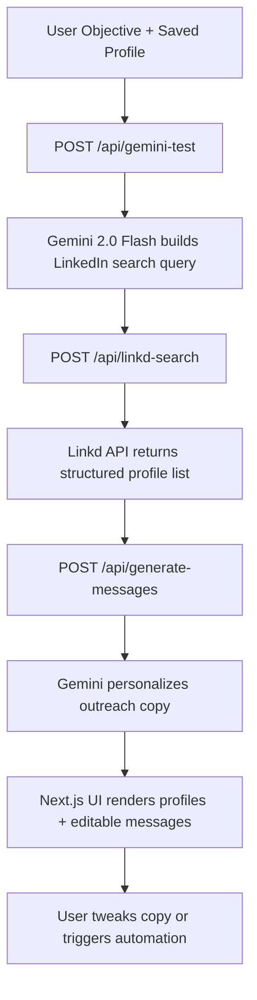
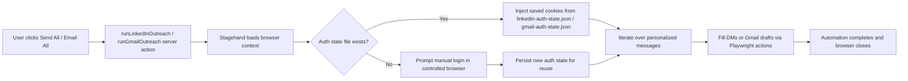

# CS53337 LinkedIn Automation

> AI-assisted LinkedIn prospecting that generates tailored outreach copy and can deliver it automatically through LinkedIn or Gmail.

## Contents
- [Overview](#overview)
- [System Architecture](#system-architecture)
- [Getting Started](#getting-started)
- [Environment Variables](#environment-variables)
- [Stagehand Automation](#stagehand-automation)
- [Project Structure](#project-structure)
- [Development Workflow](#development-workflow)
- [Troubleshooting](#troubleshooting)
- [Manual Verification](#manual-verification)

## Overview
This Next.js 15 application helps students discover relevant LinkedIn contacts and draft high-quality outreach messages in minutes. The workflow combines:
- **Gemini 2.0 Flash** for prompt generation and personalized messaging.
- **Linkd search API** for structured LinkedIn prospect discovery.
- **Stagehand** (Browserbase) automations to deliver messages at scale via LinkedIn DMs or Gmail drafts.
- A responsive, client-side experience built with Tailwind UI primitives and Radix components.

Core user journey:
1. Capture the student's objective (e.g., "Find alumni in FAANG for coffee chats").
2. Generate a precise LinkedIn search query using Gemini.
3. Fetch enriched profile data through Linkd.
4. Draft personalized outreach copy for each profile.
5. Optionally push those messages straight into LinkedIn or Gmail with Stagehand.

## System Architecture


### Key Modules
- **UI:** `src/app/page.tsx` orchestrates state (search, message generation, automation triggers). Shared widgets live in `src/components/`.
- **API Routes:** Located under `src/app/api/`, each wrapping a capability (Gemini query generation, Linkd search, message generation).
- **Services:** `src/services/` houses Linkd/Gemini/message helper clients with runtime logging and error handling.
- **Automation:** `src/app/stagehand/main.ts` drives Stagehand flows, persisting login state in `linkedin-auth-state.json` and `gmail-auth-state.json`.
- **Lib:** `src/lib/stagehand-utils.ts` contains reusable Stagehand helpers such as cached actions and overlay drawing.

## Getting Started
### Prerequisites
- Node.js 20.0+ (Next.js 15 requires the Node 20 runtime).
- npm 10+.
- Access to the required third-party APIs (Google Gemini, Linkd, Browserbase/Stagehand).

### Setup Steps
1. **Install dependencies**
   ```bash
   npm install
   ```
2. **Create `.env.local`** and populate the variables in the [Environment Variables](#environment-variables) section.
3. **Seed local profile (optional)**: from the landing page, open the Profile tab and save your details. They are stored in `localStorage` for reuse across sessions.
4. **Run the dev server**
   ```bash
   npm run dev
   ```
   The app boots on `http://localhost:3000` with system CA support for Linkd.
5. **Build for production** (CI step)
   ```bash
   npm run build
   npm run start
   ```
6. **Lint before committing**
   ```bash
   npm run lint
   ```

## Environment Variables
Create an `.env.local` file in the repo root with the following keys:

| Variable | Purpose |
| --- | --- |
| `GEMINI_API_KEY` | Google AI Studio key used by Gemini for query + message generation. |
| `LINKD_API_KEY` | Secret for the Linkd search API (`lk_` prefix). Required to return profile results. |
| `BROWSERBASE_API_KEY` | Browserbase key consumed by Stagehand when `env` is `BROWSERBASE` or for authenticated local runs. |
| `BROWSERBASE_PROJECT_ID` | Browserbase project identifier used for session creation. |

Additional Stagehand options (see `stagehand.config.ts`) can be supplied via env vars if you need to override defaults such as session IDs.

## Stagehand Automation
Trigger LinkedIn or Gmail outreach from the **Generated Outreach Messages** panel using the "Send All Messages" (LinkedIn) or "Email All Messages" (Gmail) buttons. Both actions call the Stagehand server routine described below.



### Tips
- Auth state files are stored at the repo root. Delete them to force a clean login.
- The controlled browser runs via Playwright; keep the window focused while logging in.
- `src/lib/stagehand-utils.ts` adds `actWithCache` so repeated actions (e.g., Gmail compose) execute reliably across runs.
- When debugging, you can run the Stagehand script directly by importing `runLinkedInOutreach` / `runGmailOutreach` in a temporary script and executing it with `node --loader ts-node/esm` (be sure to clean up afterwards).

## Project Structure
```
src/
  app/
    api/               # Next.js API routes (Gemini, Linkd, message generation)
    dashboard/         # Additional dashboard routes
    explore/           # Public explore view
    profile/           # Profile capture + persistence UI
    stagehand/         # Server actions backing automation
  components/          # Shared widgets (search form, profile/message cards)
  components/ui/       # Shadcn/Radix-based primitives
  lib/                 # Stagehand utilities and non-React helpers
  services/            # External API clients & business logic wrappers
public/                # Static assets
stagehand.config.ts    # Stagehand + Browserbase configuration
```

## Development Workflow
- Use `npm run dev` during feature work; hot reloads maintain local profile data in `localStorage`.
- Prefer importing modules via `@/` aliases (configured in `tsconfig.json`).
- Tailwind v4 is configured through `@tailwindcss/postcss`; utilities live inline with components.
- Stagehand scripts default to `env: "LOCAL"`. Switch to Browserbase by setting `env=BROWSERBASE` in `stagehand.config.ts` or overriding via environment variables.
- Playwright is available for future automation tests (`devDependencies`).

## Troubleshooting
- **Linkd search returns 401** → verify `LINKD_API_KEY` format (`lk_...`) and that `NODE_OPTIONS="--use-system-ca"` is present (handled in the `dev` script).
- **Gemini errors** → confirm the key has access to the `gemini-2.0-flash` model and that your usage quota is not exceeded.
- **Stagehand stalls on login** → ensure the Playwright window is foregrounded, or reset auth files. For Gmail you may need to re-authorize less-secure app access depending on the account.
- **Messages show "Generating personalized message..."** → check server logs for rate limit errors; Gemini responses are sequential to respect quotas.

## Manual Verification
Before raising a PR, validate the following flows locally:
1. Generate a query and confirm at least one profile appears in the results list.
2. Inspect the autogenerated outreach message for relevance, then regenerate to ensure retries work.
3. Trigger "Send All Messages" with a test LinkedIn profile and confirm Stagehand opens the DM composer.
4. Trigger "Email All Messages" to verify Gmail drafts populate (subject optional).
5. Run `npm run lint` and resolve any warnings.

